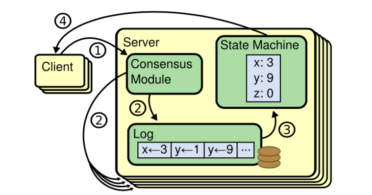
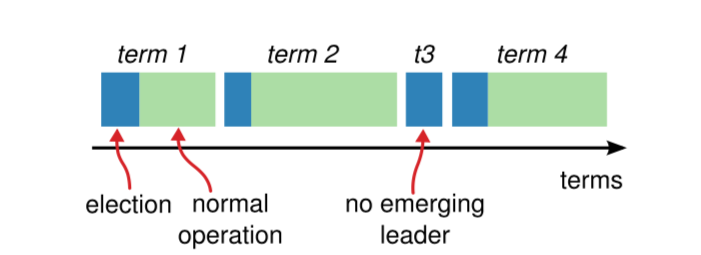
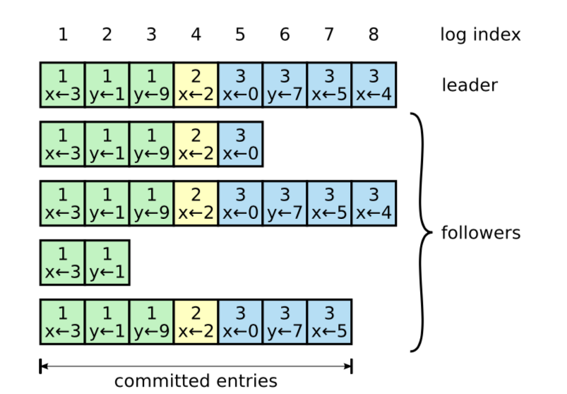
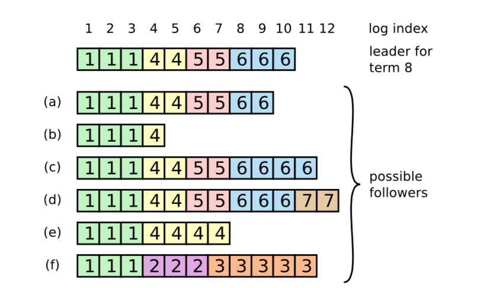
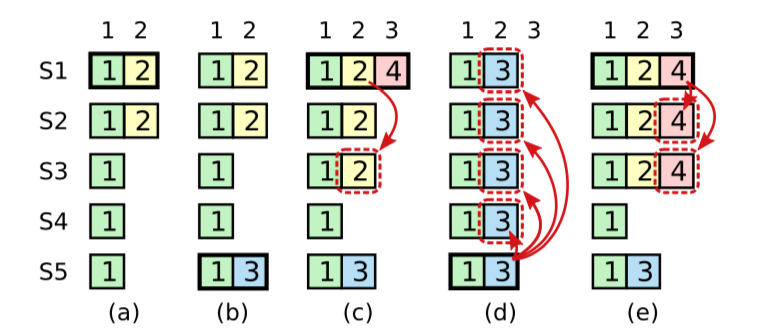

# 			Raft共识算法

## 摘要

**Raft**是一种用于日志副本(**replicated log**)管理的共识(**consensus**)的算法。它的构造与著名的**Paxos**算法不同，但提供了跟**Paxos**算法同样的一致性保证，并且它是足够高效的；相比**Paxos**算法，**Raft**更容易理解，它为构建实际系统提供了更好的基础。为了增强理解性，**Raft**将共识协议划分成3个关键部分：领导者选举，日志复制和安全性，并且为了减少需要考虑的状态数量，**Raft**增强了一致性的程度。从用户的学习反馈反映出，**Raft**比**Paxos**更易于学习。**Raft**还包含了一种改变集群成员的新机制，该机制使用覆盖集群中多数集的方法来保证算法的安全性。

## 1 引言

共识算法使得一组机器像一个整体一样，即使其中某些机器出现故障也能继续对外提供正常的服务。因此，共识算法在构建高可用的大型软件系统中扮演了关键的角色。在过去的十年，对一致性算法的讨论和研究主要围绕着**Paxos**算法：大多数共识协议的实现都是基于**Paxos**或受其影响，**Paxos**算法也成为了用于教授学生共识算法的主要工具。

不幸的是，**Paxos**实在太难理解，即使人们已经做了许多使其更易于理解的尝试。另外，要想将它应用到实用系统中，必须对它的结构做一定的调整。因此，**Paxos**让系统构建者和学生都感到十分头疼。

在**Paxos**研究上的痛苦经历，让我决心研究一种新的对学生和系统构建者都更容易接受的共识算法。我们的首要目标是易理解性：我们是否可以为构建现实系统定义一种共识算法，用比**Paxos**更容易接受的方式样来描述它？另外，对系统开发者来说，这个共识算法应该易于实现。让算法工作很重要，更重要的是理解如何工作。

这项研究的结果是被我们称为Raft的共识算法。在设计**Raft**的时候，我们使用了一些特殊的技术以增加其可理解性，这些技术包括，分解(**Raft**可以被单独划分成领导者选举，日志复制和安全性三部分)，减少状态空间的数量(相对于**Paxos**,Raft减少了不确定性的程度，以及服务器之间保持一致的方式)。通过两所大学43名学生的学习反馈来看，相比于**Paxos**,Raft显著的提高了理解性，其中的33名学生在解答Raft相关问题的时候要比**Paxos**做得更好。

**Raft**于现存的许多共识算法有很多相似性，但也拥有自己的新特性：

* 强领导人：相对于其他一致性算法，**Raft**采用了一种更强的*领导人*策略。例如，日志条目只能从*领导人*复制到其它服务器。这使得日志副本的管理更简单，同时让**Raft**更容易被理解。
* 领导人选举：**Raft**使用随机定时器进行*领导人*选举。通过往现存共识算法中已存在在心跳机制上添加一点变化制使得选举冲突处理更简单快速。
* 成员改变：当集群中部分机器发生变化时，Raft采用了一种新的联合共识方法，在关系转换的过程中，两个不同配置中的大多数机器是重叠的。这使得集群在发生配置改变的时候依旧可以提供正常服务。

我们认为，无论在教学还是作为实现基础上，**Raft**要比**Paxos**和其它共识算法更优秀。它比其它算法更简单也更容易理解；它的描述已经完全满足系统实现的需要；并且已经存在多个开源实现，被许多不同的公司所采用；它的安全特性被正式定义和证明；效率也比得上其它的共识算法。

本文余下的部分将介绍副本状态机问题(第2节)，讨论**Paxos**的优缺点(第3节)，讨论我们用于增强理解性的方法(第四节)，描述**Raft**共识算法(第5到8节)，评价**Raft**(第9节)，讨论其它相关工作(第10节)。

## 2 副本状态机

共识算法通常基于副本状态机。通过这个方法，集群中的服务器运行各自的状态机分别对同一个状态的副本执行独立计算，使得集群在某些机器出现崩溃的情况下依旧可以对外提供服务。副本状态机用于解决分布式系统中的多种容错问题。

   

*图1：副本状态机的结构。共识算法管理日志副本，日志条目包含了来自客户端的对状态机的操作命令。各状态机按照一致的顺序执行日志中的命令，使得它们产生一致的输出。*

对于采用单独领导者的大规模系统，如GFS，HDFS，RAMCloud，通常使用独立的副本状态机来管理领导者选举和存储配置信息，使得领导者出现崩溃的情况下能快速恢复。使用副本状态机的例子还包括Chubby和ZooKeeper。

如图1，副本状态机通过日志副本的方式实现。集群中每台机器都保存了同一份日志的副本，日志的内容是一系列操作命令。各机器上的状态机按日志副本中的命令序列执行操作。因为状态机都是确定的，他们各自计算得到相同的状态并产生一致的输出序列。

共识算法的任务是保证日志副本的一致性。一台机器上的共识模块负责接收来自客户端的命令，将它们追加到本地日志。然后将命令复制到集群中的其它参与者，并确保在某些机器崩溃的情况下各参与者最终包含一份同样的命令操作序列。一旦命令被正确复制，所有参与者上的状态机各自按照日志顺序执行命令然后将执行结果返回给客端。由此，整个集群看上去就像是一台高可用的状态机。

应用于实际系统的共识算法通常包含以下的特性：

* 在非拜占庭条件，如：网络延时，网络分区，丢包，消息重复以及消息乱序等情况下确保安全性(决不返回错误的结果)。
* 只要集群中的大多数机器能正常工作，且它们之间以及跟客户端之间的通信是正常的，系统就必须保持可用。因此，在一个拥有5台机器的集群系统中，可以容忍任意2台机器发生异常。机器停机被当成是发生异常；之后它们可以从持久性存储中恢复状态并重新加入集群。
* 不依赖时序来保证日志副本的一致性：时钟错误和严重的消息延迟在极端情况下只会影响到系统的可用性。
* 通常情况下，当集群中大部分参与者达成一致之后即可答复客户端。少部分缓慢的机器不应该影响整个系统的性能。

## 3 Paxos的不足之处

在过去的十年，*Leslie Lamport*的**Paxos**协议几乎成为了共识算法的代名词：几乎所有的大学将其用于共识算法的教学，大多数共识算法的实现也以它作为起点。**Paxos**首先定义了一种对单一决策(如复制单个日志条目)，达成一致的协议。我们将**Paxos**的这一子集称为单决策(single-decree)**Paxos**。**Paxos**通过多次运行协议，完成对一系列决策(如整个日志)达成一致(multi-Paxos)。**Paxos**确保安全性和活性，支持集群成员的改变。它的正确性已经被证明，在大多数情况下能保证很高的性能。

不幸的是，**Paxos**有两个显著的缺点。第一个缺点是，**Paxos**非常难以理解。**Paxos**的完整描述出了名的晦涩。仅有少部分人在付出了巨大的努力之后才把它搞明白。因此，有很多人尝试通过更简单的术语来陈述**Paxos**算法。这些陈述将关注点放在单决策**Paxos**上，即使如此，要理解它还是一项具有挑战的任务。在2012年的NSDI上，我们对出席者做了一个非正式的调查，发现即使对于资深研究者，要理解**Paxos**也是相当困难的。我们自己也深陷其中，在阅读了大量简化的陈述并设计出我们自己的共识协议之后，我们才终于完全理解了**Paxos**算法，整个过程历时接近一年。

我们推测，**Paxos**算法的晦涩来自于它选择了单决策子集作为它的基础。单一决策**Paxos**晦涩且微妙：它分为两个步骤，这两个步骤没有直观的解释，并且无法单独的理解。因此，无法直观的理解单一决策协议是如何工作的。而多决策**Paxos**复合规则增加了额外的复杂性和微妙性。我们认为，在多个决策达成一致这个问题上应该存在更直接和清楚的解决办法。

**Paxos**的另一个问题是，没有为构建实际系统提供足够的基础。其中一个原因是不存在被广泛接受的多决策**Paxos**算法。*Lamport*对**Paxos**的描述基本只针对单决策**Paxos**；他只是粗略描述了实现多决策**Paxos**的可能方法，没有更多的细节。人们做了许多尝试来具体化和优化**Paxos**，例如[26]，[39]和[13]，但是，它们各不相同，并且也跟*Lamport*的描述不一致。Chubby[4]实现了一个类似**Paxos**的算法，但它的很多实现细节并没有被公开。

另外，**Paxos**的结构并不利于构建实用系统；这是使用单决策分解问题所导致的结果(即通过运行多个单决策Paxos来处理多决策**Paxos**)。例如：单独的选择一组日志条目，然后将它们融合到一个序列化的日志中没能获得太大的好处反而极大的增加了复杂性。一种更简单和高效的方式是围绕一个日志来设计系统，将新的日志条目按照严格的顺序添加到日志中去。另一个问题是，**Paxos**是建立在对等体的点对点连接(peer-to-peer)上的(尽管它最终提出了一种弱领导者的形式来优化性能)。这对于仅制定一个决策的系统才有效，很少有实用系统采用这种方法。如果需要制定一系列的决策，先选择一个领导者，然后让领导者来协调制定决策显然是一种更简单和快速的方法。

因此，实用系统与**Paxos**几乎没有太多相似之处。许多实现都从**Paxos**开始着手，发现难以实现，最后选择了一种与**Paxos**完全不同的结构。这是一项费时且容易出错的工作，**Paxos**的晦涩加剧了问题的难度。**Paxos**在证明理论的正确性上具有很高的价值，但在实现上其价值不是太高。以下是来自Chubby的一段注释，这非常足以说明问题：

​	*Paxos算法的描述与实用系统的需求之间存在着巨大的鸿沟..最终实现的系统往往是建立在没有被证明正确性的协议[4]之上。*

由于这些问题，我们得出结论，**Paxos**没有为构建系统或教育提供一个良好的基础。考虑到共识算法在大规模分布式系统中的重要地位，我们决定尝试去设计一种可以替代**Paxos**，更具优势的共识算法。Raft共识算法正是这项尝试的结果。

## 4 易于理解的设计

在**Raft**的设计上，我们有几个目标：它必须对构建实用系统提供足够良好的基础，减少开发者的设计工作；它必须在所有情况下都是安全的，并且在大多数情况下保证可用性；通常情况下必须足够高效。但我们最重要和最具挑战性的目标是易理解性。它必须能让大多数的学习和使用者易于接受和理解算法的原理，让系统构建者在构建实用系统的时候可以按实际需求对算法进行有效的扩展。

在**Raft**的上，有很多关键点需要我们从多种方法中做出选择。我们基于易理解性来衡量不同的方法：把这种方法解释清楚有多困难（例如，它的状态空间有多复杂，它是否有细微的含义?)，读者是否可以轻易的理解这种方法和它的含义？

我们理解这种分析是具有高度主观性的；尽管如此，我们还是使用了两种普遍适用的技术。第一种是分解复杂问题：只要可能，我们就将一个大的问题分解为一些更小的单独的子问题，这些子问题可以被单独的解决，解释和理解。例如：我们把**Raft**分解成领导选取，日志复制，安全性和成员改变四个子问题。

我们的第二种方法是通过减少需要考虑的状态的数量来简化状态空间，使系统更加一致，尽可能地消除不确定性。具体来说，日志副本之间不允许存在空洞，并且**Raft**限制了日志副本之间出现不一致的方式。在大多数情况下，我们努力消除不确定性，但在一些特殊情况下，不确定性有助于提高可理解性。特别是，随机化会引入不确定性，但是它倾向于通过以相似的方式处理所有可能的选择来减少状态空间。我们使用随机化来简化了 **Raft** 中的领导选取算法。

## 5 Raft共识算法

**Raft** 是一种用来管理第 2 章中提到的日志副本的算法。图2总结了算法，图3列出了算法的关键性质；细节问题将会在本章的剩余部分中进行讨论。

**Raft**达成共识的方式是，选取一个领导，将管理日志复制的职责交给领导。领导接收客户端提交的日志条目，将条目复制到集群中的其它成员，并告诉它何时可以安全的将日志条目中包含的命令交给它们的状态机执行。单一领导简化了日志复制的管理。例如，领导可以自主决定将新的日志条目放置在日志中的什么位置，数据流只能从领导流向其它参与者。领导可以出现故障，或者与其它参与者中断连接，无论出现哪种情况，都会选出一个新的领导。

通过选取单一领导，**Raft**将共识问题分解为3个相对独立的子问题，我们将会在后面的子章节中分别对这些子问题分别讨论：

* 领导选取：当前领导出现故障时必须选取一个新的领导(5.2)。
* 日志复制：领导必须接收客户端提交的日志条目，将条目复制到集群中的其它参与者，并强制要求所有参与者的日志副本与自己的一致(5.3)。
* 安全性：**Raft**的关键安全特性是图3中描述的状态机安全限制：一旦某个参与者将日志中特定位置的日志条目中的操作应用到了它的状态机，那么所有参与者在这个位置的日志条目中所包含的操作必须是一致的。5.4讨论了**Raft**是如何保证这一点的；解决方案涉及到一个对于选举机制另外的限制，这一部分会在 5.2 中说明。

在陈述完共识算法之后，本章剩余副本继续讨论可用性以及时序在系统中扮演的角色。

###  5.1 Raft基础

一个**Raft**集群包含多台机器；对于一个拥有5台机器的集群，系统可以在任意2台服务器发生故障的情况下保持可用。在任意时刻，每一台服务器必定会处于以下三种状态中的一个：*领导人*、*候选人*、*追随者*。在正常情况下，集群中正好拥有一个*领导人*，其它机器都是*追随者*。*追随者*完全是被动的：它们不会发起任何请求，只是简单的响应来自*领导者*或*候选人*的请求。由领导者负责处理来自客户端的请求(如果客户端向*追随者*发起请求，*追随者*会把客户端连接重定向到*领导人*)。*候选人*用于选举出新的*领导人*，我们将会在5.2节进行讨论。图4展示了这些状态及它们之间是如何转变的；状态转变将会在后面继续讨论。

*图4：服务器状态。追随者只响应来自其它服务器的请求。如果追随者在超时到达时没有收到任何消息，它就转变成候选人并启动一轮选取。如果候选人获得集群中的大多数选票，它变成新的领导者。领导者通常持续到它发生故障*

*图5：时间被划分成一个个term，term从触发选举开始。一旦选举成功，领导者负责管理整个集群直到term结束。有的选举会因为无法选取出唯一的领导者而失败，相应的term也因此结束。不同的服务器感知到term变更的时间点可能会不一致。*

如图5所示，**Raft**将时间划分为任意长度不等的任期。所有term使用递增的整数编号。一个term起始于一轮选举，在此过程中一个或多个*候选人*将通过5.2节讨论的方法竞争成为*领导人*。如果有唯一的一个*候选人*胜出，它将成为当前term的*领导人*。在某些情况下所有*候选人*的无法获得足够的选票。在这种情况下当前term将会因为无法选出*领导人*而结束；新的选举将在短时间内触发，由此开始一个新的term。**Raft**确保在任何term中最多只存在一个*领导人*。

不同的服务器感知到term发生变更时间点可能会不一致，某些情况下甚至会出现有服务器无法感知选举甚至整个term的情况。在**Raft**中term充当逻辑时钟[14]的角色，服务器可以通过term来检测过期的信息，如过时的领导人。每台服务器保存着一个当前term的编号，这个编号随着时间单调递增。每当服务器之间发生联系时，它们会交换当前term信息；如果一台服务器保存的当前term编号比另外一台的数值小，那么它将把自己保存的当前term编号替换成另一台服务器的值。如果一个候选人或领导人发现本地的当前term编号已经过期(发现有更大的任期编号)，它必须马上把自己转变成追随者状态。如果一台服务器接收到一个包含过期term编号的请求，它必须拒绝这个请求。

在**Raft**集群中，服务器之间通过**RPC**进行通信，基础的共识算法只需要两种不同类型的**RPC**方法。**RequestVote RPC**由候选人在选举期间发起(5.2节)，**AppendEntries RPC**由领导人发起，它用于日志复制及心跳(5.3节)。第7章将增加第3种**RPC**用于在服务器之间传输快照。如果没能及时收到**RPC**回复，发起方将会重试，为了获得更好的性能，服务器将并行发起多个**RPC**。

### 5.3 领导人选举

**Raft**通过心跳机制触发*领导人*选举。当服务器启动之后，它们首先成为*追随者*。只要服务器持续接收到来自*领导人*或*候选人*的合法**RPC**，它就会一直维持在*追随者*状态。领导人通过周期性的给*追随者*发送心跳(不包含日志条目的**AppendEntries RPC**)来维护自己的领导人地位。如果一个追随者在一段被称为*选举超时*的时间之内没有收到任何消息，它将假设当前没有可用的领导人，并触发一轮选举来选择新的领导人。

为了开始一轮新的选举，追随者首先递增本地的当前term编号，将自己转变为候选人状态。之后它给自己投上一票，接着并行的向集群中的其它机器发送**RequestVote RPC**。一个候选人将保持在这个状态直到以下三种情况出现：(a)自己赢得选举，(b)别的机器赢得选举称为领导人，(c)选举超时，没有任何一个候选人成为领导人。下面将会分别讨论各种情况。

如果一个候选人获得集群中大多数机器(这些机器的term编号与候选人一致)的选票，它将赢得选举。在给定的term内，所有服务器根据先到先得的原则(注意：在5.4节中，给投票增加了额外的限制)只能给最多一个候选人投出选票。规则确保了在指定的term内，最多只能有一个候选人赢得选举(图3中的选举安全性限制)。一旦候选人赢得选举，它就称为领导人。它发送心跳消息给集群中其它参与者维持它的领导人地位防止触发新的选举。

在等待选票的过程中，候选人可能会接收到来自其它服务器的**AppendEntries RPC**,宣称自己称为领导人。如果**RPC**中携带的term编号大于等于自己的当前term编号，那么候选人将承认对方的领导人地位并回到随者状态。否则，它拒绝这个**RPC**，继续维持在候选人状态。

第三种情况的结果是没有任何一个候选人赢得选举：如果有多个追随者同时变成候选人，选票将被瓜分，使得没有任何一个候选人能获得大多数选票。当这种情况发生，选举会超时，候选人递增当前term编号并发起新一轮的选举。但是，如果对此不做任何限制，选票被分割的情形可能会无限重复出现。

**Raft**通过选择随机的超时时间来确保选票瓜分的情况很少会发生，即使在发生了也可以快速解决。为了防止选票被分割，首先应该避免所有追随者在同一时间触发选举，选举超时时间可以从一个固定的时间范围内中随机选取，使得各服务器有不同的到期时间，在大多数情况下仅有一个追随者到期，触发选举，转变成候选人拉票，这样，它很快就可以获得足够的选票，成为领导人。同样的机制可以应用在无法选出领导人的情况：每个候选人在触发选举的时候设置一个随机的选举超时时间，到期之后再触发一轮新的选举，这就避免了有多个候选人同时到期触发一轮新选举并导致选票被瓜分的情况。9.3节将展示通过这种手段可以快速选出一个领导人。

领导选举是以易理解性作为方针，引导我们做出设计选择的一个例子。最开始，我们计划使用基于排名的系统：为每台机器设置一个唯一的排名，用排名作为从多个竞争者中选取*领导人*的依据。如果一个*候选人*发现有其它*候选人*的排名比自己的高，它就返回*追随者*状态，这使得排名高的*候选人*能更轻易的赢得下一轮选举。但我们发现，这个方法会产生影响可用性的微妙问题(如果排名较高的服务器出现故障，则排名较低的服务器可能需要超时并再次成为*候选人*，但如果过早这样做，则可能会重置选举*领导人*的进度)。我们对这个算法做出了多次调整，但每次调整都会出现新的边界问题。最终我们得出结论，随机重试的方法才是更明确和易于理解的。

### 5.3 日志复制

当*领导人*被选出，它开始处理来自客户端的请求。客户端的每个请求包含着一条被副本状态机执行的命令。*领导人*将这条命令封装到一个日志条目，将条目追加到本地日志末端，然后它并行的向其它成员发送**AppendEntries RPC**将日志条目复制给它们。当日志被安全的复制，*领导人*将条目中的命令应用到它的状态机上，并将执行返回给客户端。如果*追随者*出现崩溃，运行缓慢或者网络丢包等情况，*领导人*将持续重(即使在结果返回给客户端之后)发**AppendEntries RPC**直到所有*追随者*的日志与自己的一致。

*图6：日志由日志条目组成，条目由有序的整数标识。日志条目包含了它被创建时的term以及供状态机执行的命令。如果一个条目可以安全的提交给状态机执行，它被认为是已提交的。*

日志以图6中展示的方式组织。每个日志条目中包含了一条状态机要执行的命令以及term编号，term编号是从*领导人* 那接收到条目时的当前term编号。条目中的term编号用于检测各日志副本之间可能存在的不一致，以及确保图3中展示的某些特性。每个条目还拥有一个整数下标，用以标识它在日志中的位置。

*领导人*决定了一个日志条目在什么时间点可以应用到所有的状态机。可被应用的条目称为*已提交*的。**Raft**确保*已提交*的条目必须被持久化，并且最终被所有可用的状态机执行。一旦*领导人*将一个日志条目复制到集群中大多数成员，这个条目就变成*已提交*（例如图6中编号为7的的条目）。这同时使得*领导人*提交此日志条目之前的所有日志条目，包括那些由之前的*领导人*创建的日志条目。5.4节将讨论将在*领导人*变更之后应用此规则存在的细微问题，同时还将展示这个对提交的定义是安全的。*领导人*记录索引值最大的*已提交*条目，在之后的所有**AppendEntries RPC**(包括心跳)中都附带这个索引，使得其它成员最终能获知这一信息。一旦*追随者*获知一个日志条目变成*已提交*，它将此条目应用到本地状态机(按日志的顺序)。

我们将**Raft**的日志机制设计成将日志在不同的机器上保持高度一致。这不仅仅是为了简化系统的行为，让它更具确定性，更重要的是确保系统的安全性。**Raft**维持以下特性，这些特性同时组成了图3所示的日志匹配原则：

* 在不同的日志副本中索引及term编号相同的日志条目包含相同的命令。
* 如果在两个不同的日志副本中，存在索引及term编号相同的日志条目，那么这两个副本在此条目之前的所有条目都是一致的。

第一条性质源于以下事实，*领导人*在指定的term里，只能在某个日志位置上创建唯一的日志条目，且日志条目在日志中的位置不能被改变。而第二条性质由**AppendEntries PRC**执行的一致性检测来确保。*领导人*在发送**AppendEntries PRC**的时候，除了在**AppendEntries PRC**中附带最新条目，还会附带最新条目前一个条目的term编号以及索引。如果*追随者*在自己的日志中找不到索引及term编号匹配的日志条目，它将拒绝将最新的条目添加到本地日志中。一致性检查就像一个归纳步骤：在日志为空时，日志匹配的性质必然是满足的。当日志扩张的时候，由一直性检查来维护日志匹配的性质。因此，一旦**AppendEntries**返回成功，*领导人*就可以确定*追随者*的日志跟自己是一致的。

*图7：当最顶上的领导人掌权之后，追随者本地日志可能出现如(a-f)中的场景。图中每个小正方形代表一个日志条目，里面的数字是term编号。一个追随者可能缺少条目(a-b)，可能多出一些未提交的条目(c-d)，或两者皆有(e-f)。例如，场景(f)是这样发生的，一台服务器在term=2的时候成为领导人，向本地日志添加一系列条目，在这些条目被提交之前，服务器崩溃；之后它快速重启，并在term=3的时候重新成为领导人，再次向本地日志添加一系列日志条目；接着在term=2和term=3的日志被提交之前，服务器再次崩溃并持续数个term。*

通常情况下，*领导人*和*追随者*之间的日志保持一致，**AppendEntries**的一致性检查从不失败。但是，如果出现*领导者*崩溃，各副本之间就会出现不一致性(*领导人*可能在完成日志条目复制之前就发生崩溃)。这种不一致的情况随着一系列*领导者*和*追随者*的崩溃变得越来越严重。图7展示了*追随者*的日志与新*领导人*的日志会出现怎样的差别。*追随者*可能会缺少*领导人*中存在的日志条目，可能会多出一些*领导人*中不存在的日志条目，或者两种情况皆有。日志中缺失或多出的条目可能跨越多个term。

在**Raft**中，*领导人*通过强制*追随者*复制自身的日志来处理这种不一致的情况。这意味着，*追随者*日志中的冲突条目将会被*领导人*日志中相应的日志条目覆盖。5.4节将会展示，通过增加一些限制，确保这样的处理方式是安全的。

为了让*领导人*和*追随者*的日志恢复到一致状态，*领导人*需要找到两份日志中最后的一个一致条目，让*追随者*删除这个条目之后的所有日志条目，并把自己在这个条目之后的所有日志条目发送给*追随者*。这些处理将在收到**AppendEntries**的失败响应(**AppendEntries**失败响应通告一致性检查失败)之后执行。*领导人*对每个*追随者*维护一个*nextIndex*，这个*index*表示*领导人*下一次发送给相应*追随者*的日志条目在日志文件中的索引。当*领导人*获得领导权之后，它将所有*追随者*的*nextIndex*设置为本地日志文件中最后一个日志条的目索引值加1(在图7里这个值是11)。如果*追随者*的日志跟*领导人*的不一致，在接下来的**AppendEntries RPC**中一致性检查将会失败。*领导人*接收到**AppendEntries RPC**的失败响应后，递减相应*追随者*的*nextIndex*并重发**AppendEntries RPC**。最终*nextIndex*会落到一个日志条目索引上，对于此索引及之前的日志条目，*领导人*和*追随者*保持一致。这个时候，**AppendEntries RPC**将会成功，使得*追随者*移除所有冲突的日志条目，并将*领导人*日志中的日志条目追加到*追随者*日志中。在这个过程完成之后，*追随者*与*领导人*的日志实现一致，并在剩余的term里继续以这种方式保持一致。

*如果有需要，可以优化协议以减少因为一致性检查失败而产生的拒绝**AppendEntries RPC**的数量。例如，在一致性检查失败的情况下，追随者可以在它的**AppendEntries RPC**响应中附带本地日志里冲突条目的term，以及这个term的第一个条目在本地日志中的索引。有了这些信息，领导人在接收到响应后就可以跳过这个term中所有冲突的条目，直接将nextIndex递减到适当的位置；因此，对于属于同一个term的冲突条目，我们不必对每个冲突条目执行一次**AppendEntries RPC**，只需要对整个term的冲突条目用一条**AppendEntries RPC**就够了。在实践中，我们对这项优化的必要性持怀疑态度，毕竟检查失败的情况少有发生，即使在出现的情况下，不一致条目的数量也不会太多。*

通过这种机制，*领导人*在获得领导权之后不必采取特殊的动作来恢复日志的一致性。只需要执行普通的日志追加操作，通过**AppendEntries RPC**的一致性检查机制使得所有的日志副本慢慢趋于一致。*领导人*绝不覆盖或删除本地日志中的日志条目(图3中，*领导人*只追加日志条目特性)。

这个日志复制机制展示了第2部分中所描述的理想的一致属性：只要集群中大多数服务器正常工作，**Raft**就可以接受，复制以及应用新的日志条目；在通常情况下，一个新的日志条目只需要一轮RPC就可以被复制到集群中的大多数机器；少数运行缓慢的*追随者*不会影响算法的效率。

### 5.4 安全性

前面的部分介绍了**Raft**如何进行*领导人*选举以及如何复制日志条目。但是，至今为止介绍的这些机制并不足以确保所有状态机以一致的顺序执行相同的命令。例如，一个*追随者*可能在*领导人*提交日志条目的时候变得不可用(由此导致这个*追随者*无法提交相应的日志条目)，当它恢复之后成为*领导人*并将这些条目覆盖。结果就是，不同的状态机可能执行不同的指令序列。

为了完成**Raft**算法，本章将添加一个限制条件，使得符合条件的机器才有资格被选取为*领导人*。限制条件将确保，对于任意指定的term，这个term中的*领导人*在其本地日志中必须包好之前的所有term中已经提交的日志条目(图3中的领导人完整性属性)。在给定选举限制条件后，我们将让提交规则更加明确。最后，我们对*领导人*完整性属性给出一个证明并展示它是如何导致副本状态机产生正确的行为。

### 5.4.1 领导人选举的限制条件

任何基于*领导人*的共识算法，*领导人*最终必须存储所有已提交的日志条目。某些共识算法，如*Viewstamped Replication[22]*，允许一个成员在没有包含所有已几条条目的情况下被选为*领导人*。这些算法包含了额外的机制用于确定缺失的条目，并将这些条目传递给新的*领导人*，这个过程或者在*领导人*选举的过程中执行，或者在选出新的*领导人*之后尽快执行。不幸的是，这产生了额外的复杂性。**Raft**使用了一种更简单的方法，它确保了只有包含所有之前term中已经提交的日志条目的*候选人*才有可能被选举为*领导人*，这意味着日志条目只能是单向流动的，从*领导人*流向*追随者*，并且*领导人*绝对不会覆写本地日志中已经存在的条目。

**Raft**通过投票过程来防止没有包含所有已提交条目的*候选人*赢得选举。为了拉票，一个*候选人*必须跟集群中服务器的一个大多数集进行通信，这意味着每一个已提交的条目必定存在于至少一台与其通信的服务器上。如果*候选人*上的日志至少和其它大多数集服务器上的日志一样新(up-to-date，明确含义将会在后面定义)，那么它将包含所有的已提交条目。**RequestVote RPC**实现了这个限制：**RPC**包含有*候选人*的日志信息，当一台服务器接收到**RequestVote RPC**它需要将自己本地的日志与**RPC**中附带的*候选人*的日志信息做比较，如果发现自己的日志更新，那么它就会拒绝这个*候选人*的拉票请求。

**Raft**通过比较两份日志副本中最后一个条目的索引和term编号来决定哪个副本是更新的(up-to-date)。如果两个副本最后的条目具有不一样的term编号，那么term编号更大的那个副本被认为是更新的。如果两个副本最后的条目具有一样的term编号，那么长度更长的日志副本被认为是更新的。

### 5.4.2

*图8：一个时间序列，说明为什么一个领导人不能使用旧的日志条目来确定是否可以提交。在(a)中，S1是领导人，它将2号条目复制到部分服务器。在(b)中，S1崩溃；S5在term 3成为领导人，在2号位置增加了一条不同的日志条目。在(c)中，S5崩溃；S1重启当选为领导人，并继续对它之前没完成的2号条目进行复制。在这个时间点，term编号为2的2号条目已经被复制到大多数服务器中，但尚未提交。如果S1在(d)时刻崩溃，S5可能被选为领导人，用自己term=3的2号条目将其它机器上term=2的2号条目覆写。但是，如果S1在将其当前term产生的3号条目复制到大多数机器之后才崩溃，如(4)，则3号条目是可提交的(S5因为选举限制无法被选为领导人)。此时，3号条目之前的所有条目都是可提交的。*

正如5.3节中描述的，*领导人*一旦将自己当前term产生的日志条目复制到集群中一个大多数集，它就可以提交这个条目。如果*领导人*在提交条目前崩溃，后续选出的*领导人*将尝试完成对这个条目的复制。但是，即使*领导人*将一个之前term的日志条目复制到集群中的大多数集，它也无法立刻得出这个条目是否可提交的结论。图8展示了这样一种情况，一个旧的条目已经被复制到大多数器中，但这个条目依旧可能被之后的*领导人*覆写。

为了避免如图8所示的情况，**Raft**不会通过副本计数(即对当前正在复制的条目计数，每当成功复制一份，计数值加1)来提交先前term的日志条目。*领导人*只有对自己当前term产生的日志条目，才通过副本计数进行提交；一旦当前term的日志条目通过这种方式被提交，日志匹配性质将使得之前的日志条目都间接变成已提交的。在某些情况下，*领导人*可以对一个旧日志条目是否已提交得出安全的结论(例如，条目已经被复制到所有的服务器)，但是，为了简单性，**Raft**选择了一种更保守的方法。

因为*领导人*在复制之前的日志条目时需要保持其原有term编号不变，**Raft**对提交规则增加了额外的复杂性。在其它共识算法中，一个新的*领导人*在复制其前任生成的条目时会将其term编号替换成当前term编号。因为日志条目的term编号保持不变，**Raft**使得对日志条目的推断变得更容易。另外，**Raft**中，新*领导人*需要发送的旧日志条目相比其它算法要少得多(在日志被提交前，其他算法必须要发送冗余的日志条来对它们重新排序)。

### 5.4.3 安全性的论证

