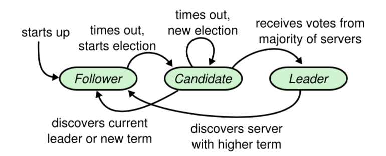

# 			Raft共识算法

## 摘要

Raft是一种用于日志副本管理的(replicated log)共识(consensus)的算法。它的构造与著名的Paxos算法不同，但提供了跟Paxos算法同样的一致性保证，并且它是足够高效的；相比Paxos算法，Raft更容易理解，它为构建实际系统提供了更好的基础。为了增强理解性，Raft将共识协议划分成3个关键部分：领导者选举，日志复制和安全性，并且为了减少需要考虑的状态数量，Raft增强了一致性的程度。从用户的学习反馈反映出，Raft比Paxos更易于学习。Raft还包含了一种改变集群成员的新机制，该机制使用覆盖集群中多数集的方法来保证算法的安全性。

## 1 引言

共识算法使得一组机器像一个整体一样，即使其中某些机器出现故障也能继续对外提供正常的服务。因此，共识算法在构建高可用的大型软件系统中扮演了关键的角色。在过去的十年，对一致性算法的讨论和研究主要围绕着Paxos算法：大多数共识协议的实现都是基于Paxos或受其影响，Paxos算法也成为了用于教授学生共识算法的主要工具。

不幸的是，Paxos实在太难理解，即使人们已经做了许多使其更易于理解的尝试。另外，要想将它应用到实用系统中，必须对它的结构做一定的调整。因此，Paxos让系统构建者和学生都感到十分头疼。

在Paxos研究上的痛苦经历，让我决心研究一种新的对学生和系统构建者都更容易接受的共识算法。我们的首要目标是易理解性：我们是否可以为构建现实系统定义一种共识算法，用比Paxos更容易接受的方式样来描述它？另外，对系统开发者来说，这个共识算法应该易于实现。让算法工作很重要，更重要的是理解如何工作。

这项研究的结果是被我们称为Raft的共识算法。在设计Raft的时候，我们使用了一些特殊的技术以增加其可理解性，这些技术包括，分解(Raft可以被单独划分成领导者选举，日志复制和安全性三部分)，减少状态空间的数量(相对于Paxos,Raft减少了不确定性的程度，以及服务器之间保持一致的方式)。通过两所大学43名学生的学习反馈来看，相比于Paxos,Raft显著的提高了理解性，其中的33名学生在解答Raft相关问题的时候要比Paxos做得更好。

Raft于现存的许多共识算法有很多相似性，但也拥有自己的新特性：

* 强领导者：相对于其他一致性算法，Raft采用了一种更强的领导者策略。例如，日志条目只能从领导者传递到其它服务器。这使得复制日志的管理更简单，同时让Raft更容易被理解。
* 领导选举：Raft使用随机定时器进行领导选举。通过往现存共识算法中已存在在心跳机制上添加一点变化制使得选举冲突处理更简单快速。
* 成员改变：当集群中部分机器发生变化时，Raft采用了一种新的联合共识方法，在关系转换的过程中，两个不同配置中的大多数机器是重叠的。这使得集群在发生配置改变的时候依旧可以提供正常服务。

我们认为，无论在教学还是作为实现基础上，Raft要比Paxos和其它共识算法更优秀。它比其它算法更简单也更容易理解；它的描述已经完全满足系统实现的需要；并且已经存在多个开源实现，被许多不同的公司所采用；它的安全特性被正式定义和证明；效率也比得上其它的共识算法。

本文余下的部分将介绍复制状态机问题(第2节)，讨论Paxos的优缺点(第3节)，讨论我们用于增强理解性的方法(第四节)，描述Raft共识算法(第5到8节)，评价Raft(第9节)，讨论其它相关工作(第10节)。

## 2 复制状态机

共识算法通常基于复制状态机。通过这个方法，集群中的服务器运行各自的状态机分别对同一个状态的副本执行独立计算，使得集群在某些机器出现崩溃的情况下依旧可以对外提供服务。复制状态机用于解决分布式系统中的多种容错问题。

   

*图1：复制状态机的结构。共识算法管理日志副本，日志条目包含了来自客户端的对状态机的操作命令。各状态机按照一致的顺序执行日志中的命令，使得它们产生一致的输出。*

对于采用单独领导者的大规模系统，如GFS，HDFS，RAMCloud，通常使用独立的复制状态机来管理领导者选举和存储配置信息，使得领导者出现崩溃的情况下能快速恢复。使用复制状态机的例子还包括Chubby和ZooKeeper。

如图1，复制状态机通过日志副本的方式实现。集群中每台机器都保存了同一份日志的副本，日志的内容是一系列操作命令。各机器上的状态机按日志副本中的命令序列执行操作。因为状态机都是确定的，他们各自计算得到相同的状态并产生一致的输出序列。

共识算法的任务是保证日志副本的一致性。一台机器上的共识模块负责接收来自客户端的命令，将它们追加到本地日志。然后将命令复制给集群中的其它参与者，并确保在某些机器崩溃的情况下各参与者最终包含一份同样的命令操作序列。一旦命令被正确复制，所有参与者上的状态机各自按照日志顺序执行命令然后将执行结果返回给客端。由此，整个集群看上去就像是一台高可用的状态机。

应用于实际系统的共识算法通常包含以下的特性：

* 在非拜占庭条件，如：网络延时，网络分区，丢包，消息重复以及消息乱序等情况下确保安全性(决不返回错误的结果)。
* 只要集群中的大多数机器能正常工作，且它们之间以及跟客户端之间的通信是正常的，系统就必须保持可用。因此，在一个拥有5台机器的集群系统中，可以容忍任意2台机器发生异常。机器停机被当成是发生异常；之后它们可以从持久性存储中恢复状态并重新加入集群。
* 不依赖时序来保证日志副本的一致性：时钟错误和严重的消息延迟在极端情况下只会影响到系统的可用性。
* 通常情况下，当集群中大部分参与者达成一致之后即可答复客户端。少部分缓慢的机器不应该影响整个系统的性能。

## 3 Paxos的不足

在过去的十年，Leslie Lamport的Paxos协议几乎成为了共识算法的代名词：几乎所有的大学将其用于共识算法的教学，大多数共识算法的实现也以它作为起点。Paxos首先定义了一种对单一决策(如复制单个日志条目)，达成一致的协议。我们将Paxos的这一子集称为单决策(single-decree)Paxos。Paxos通过多次运行协议，完成对一系列决策(如整个日志)达成一致(multi-Paxos)。Paxos确保安全性和活性，支持集群成员的改变。它的正确性已经被证明，在大多数情况下能保证很高的性能。

不幸的是，Paxos有两个显著的缺点。第一个缺点是，Paxos非常难以理解。Paxos的完整描述出了名的晦涩。仅有少部分人在付出了巨大的努力之后才把它搞明白。因此，有很多人尝试通过更简单的术语来陈述Paxos算法。这些陈述将关注点放在单决策Paxos上，即使如此，要理解它还是一项具有挑战的任务。在2012年的NSDI上，我们对出席者做了一个非正式的调查，发现即使对于资深研究者，要理解Paxos也是相当困难的。我们自己也深陷其中，在阅读了大量简化的陈述并设计出我们自己的共识协议之后，我们才终于完全理解了Paxos算法，整个过程历时接近一年。

我们推测，Paxos算法的晦涩来自于它选择了单决策子集作为它的基础。单决策Paxos晦涩且微妙：它分为两个步骤，这两个步骤没有直观的解释，并且无法单独的理解。因此，无法直观的理解单一决策协议是如何工作的。而多决策Paxos复合规则增加了额外的复杂性和微妙性。我们认为，在多个决策达成一致这个问题上应该存在更直接和清楚的解决办法。

Paxos的另一个问题是，没有为构建实际系统提供足够的基础。其中一个原因是不存在被广泛接受的多决策Paxos算法。Lamport的描述几乎只针对单决策Paxos；他只是粗略描述了实现多决策Paxos的可能方法，没有更多的细节。人们做了许多尝试来具体化和优化Paxos，例如[26]，[39]和[13]，但是，它们各不相同，并且也跟Lamport的描述不一致。Chubby[4]实现了一个类似Paxos的算法，但它的很多实现细节并没有被公开。

另外，Paxos的结构不利于构建实用系统；这是由单决策分解导致的结果。例如：单独的选择一组日志条目，然后将它们融合到一个序列化的日志中没能获得太大的好处反而极大的增加了复杂性。一种更简单和高效的方式是围绕一个日志来设计系统，将新的日志条目按照严格的顺序添加到日志中去。另一个问题是，Paxos是建立在对等体的点对点连接(peer-to-peer)上的(尽管它最终提出了一种弱领导者的形式来优化性能)。这对于仅制定一个决策的系统才有效，很少有实用系统采用这种方法。如果需要制定一系列的决策，先选择一个领导者，然后让领导者来协调制定决策显然是一种更简单和快速的方法。

因此，实用系统与Paxos几乎没有太多相似之处。许多实现都从Paxos开始着手，发现难以实现，最后选择了一种与Paxos完全不同的结构。这是一项费时且容易出错的工作，Paxos的晦涩加剧了问题的难度。Paxos在证明理论的正确性上具有很高的价值，但在实现上其价值不是太高。以下是来自Chubby的一段注释，这非常足以说明问题：

​	*Paxos算法的描述与实用系统的需求之间存在着巨大的鸿沟..最终实现的系统往往是建立在没有被证明正确性的协议[4]之上。*

由于这些问题，我们得出结论，Paxos没有为构建系统或教育提供一个良好的基础。考虑到共识算法在大规模分布式系统中的重要地位，我们决定尝试去设计一种可以替代Paxos，更具优势的共识算法。Raft共识算法正是这项尝试的结果。

## 4 易于理解的设计

在Raft的设计上，我们有几个目标：它必须对构建实用系统提供足够良好的基础，减少开发者的设计工作；它必须在所有情况下都是安全的，并且在大多数情况下保证可用性；通常情况下必须足够高效。但我们最重要和最具挑战性的目标是易理解性。它必须能让大多数的学习和使用者易于接受和理解算法的原理，让系统构建者在构建实用系统的时候可以按实际需求对算法进行有效的扩展。

在Raft的上，有很多关键点需要我们从多种方法中做出选择。我们基于易理解性来衡量不同的方法：把这种方法解释清楚有多困难（例如，它的状态空间有多复杂，它是否有细微的含义?)，读者是否可以轻易的理解这种方法和它的含义？

我们理解这种分析是具有高度主观性的；尽管如此，我们还是使用了两种普遍适用的技术。第一种是分解复杂问题：只要可能，我们就将一个大的问题分解为一些更小的单独的子问题，这些子问题可以被单独的解决，解释和理解。例如：我们把Raft分解成领导选取，日志复制，安全性和成员改变四个子问题。

我们的第二种方法是通过减少需要考虑的状态的数量来简化状态空间，使系统更加一致，尽可能地消除不确定性。具体来说，日志副本之间不允许存在空洞，并且Raft限制了日志副本之间出现不一致的方式。在大多数情况下，我们努力消除不确定性，但在一些特殊情况下，不确定性有助于提高可理解性。特别是，随机化会引入不确定性，但是它倾向于通过以相似的方式处理所有可能的选择来减少状态空间。我们使用随机化来简化了 Raft 中的领导选取算法。

## 5 Raft共识算法

Raft 是一种用来管理第 2 章中提到的复制日志的算法。图2总结了算法，图3列出了算法的关键性质；细节问题将会在本章的剩余部分中进行讨论。

Raft达成共识的方式是，选取一个领导，将管理日志复制的职责交给领导。领导接收客户端提交的日志条目，将条目复制到集群中的其它成员，并告诉它何时可以安全的将日志条目中包含的命令交给它们的状态机执行。单一领导简化了日志复制的管理。例如，领导可以自主决定将新的日志条目放置在日志中的什么位置，数据流只能从领导流向其它参与者。领导可以出现故障，或者与其它参与者中断连接，无论出现哪种情况，都会选出一个新的领导。

通过选取单一领导，Raft将共识问题分解为3个相对独立的子问题，我们将会在后面的子章节中分别对这些子问题分别讨论：

* 领导选取：当前领导出现故障时必须选取一个新的领导(5.2)。
* 日志复制：领导必须接收客户端提交的日志条目，将条目复制到集群中的其它参与者，并强制要求所有参与者的日志副本与自己的一致(5.3)。
* 安全性：Raft的关键安全特性是图3中描述的状态机安全限制：一旦某个参与者将日志中特定位置的日志条目中的操作应用到了它的状态机，那么所有参与者在这个位置的日志条目中所包含的操作必须是一致的。5.4讨论了Raft是如何保证这一点的；解决方案涉及到一个对于选举机制另外的限制，这一部分会在 5.2 中说明。

在陈述完共识算法之后，本章剩余副本继续讨论可用性以及时序在系统中扮演的角色。

###  5.1 Raft基础

一个Raft集群包含多台机器；对于一个拥有5台机器的集群，系统可以在任意2台服务器发生故障的情况下保持可用。在任意时刻，每一台服务器必定会处于以下三种状态中的一个：*领导人*、*候选人*、*追随者*。在正常情况下，集群中正好拥有一个*领导人*，其它机器都是*追随者*。*追随者*完全是被动的：它们不会发起任何请求，只是简单的响应来自*领导者*或*候选人*的请求。由领导者负责处理来自客户端的请求(如果客户端向*追随者*发起请求，*追随者*会把客户端连接重定向到*领导人*)。*候选人*用于选举出新的*领导人*，我们将会在5.2节进行讨论。图4展示了这些状态及它们之间是如何转变的；状态转变将会在后面继续讨论。

*图4：服务器状态。追随者只响应来自其它服务器的请求。如果追随者没有收到任何消息，它就转变成候选人并启动一轮选取。如果候选人获得集群中的大多数选票，它变成新的领导者。领导者通常持续到它发生故障*

*图5：时间被划分成一个个任期，任期从发生选举开始。一旦选举成功，领导者负责管理整个集群直到任期结束。有的选举会因为无法选取出唯一的领导者而失败，相应的任期也因此结束。不同的服务器感知到任期变更的时间点可能会不一致。*

如图5所示，Raft将时间划分为任意不同长度的任期。所有任期使用连续的整数编号。一个任期起始于一轮选举，在此过程中一个或多个*候选人*将通过5.2节讨论的方法竞争成为*领导人*。如果有唯一的一个*候选人*胜出，它将在后续的整个任期中成为*领导人*。在某些情况下所有*候选人*的无法获得足够的选票。在这种情况下当前任期将会因为无法选出*领导人*而结束；新的选举将在短时间内触发，由此开始一个新的任期。Raft确保在任意任期中最多只存在一个*领导人*。

不同的服务器感知到任期变更时间点可能会不一致，某些情况下甚至会出现有服务器无法感知选举甚至整个任期的情况。在Raft中任期充当逻辑时钟[14]的角色，服务器可以通过任期来检测过期的信息，如过时的领导人。每台服务器保存着一个当前任期的序号，这个序号随着时间单调递增。每当服务器之间发生联系时，它们会交换当前任期信息；如果一台服务器保存的当前任期号比另外一台的数值小，那么它将把自己保存的当前任期号替换成另一台服务器的值。如果一个候选人或领导人发现本地的当前任期号已经过期(发现有更大的任期号)，它必须马上把自己转变成追随者状态。如果一台服务器接收到一个包含过期任期号的请求，它必须拒绝这个请求。

在Raft集群中，服务器之间通过RPC进行通信，基础的共识算法只需要两种不同类型的RPC方法。RequestVote RPC由候选人在选举期间发起(5.2节)，AppendEntries RPC由领导人发起，它用于日志复制及心跳(5.3节)。第7章将增加第3种RPC用于在服务器之间传输快照。如果没能及时收到RPC回复，发起方将会重试，为了获得更好的性能，服务器将并行发起多个RPC。

### 5.3 领导人选举

